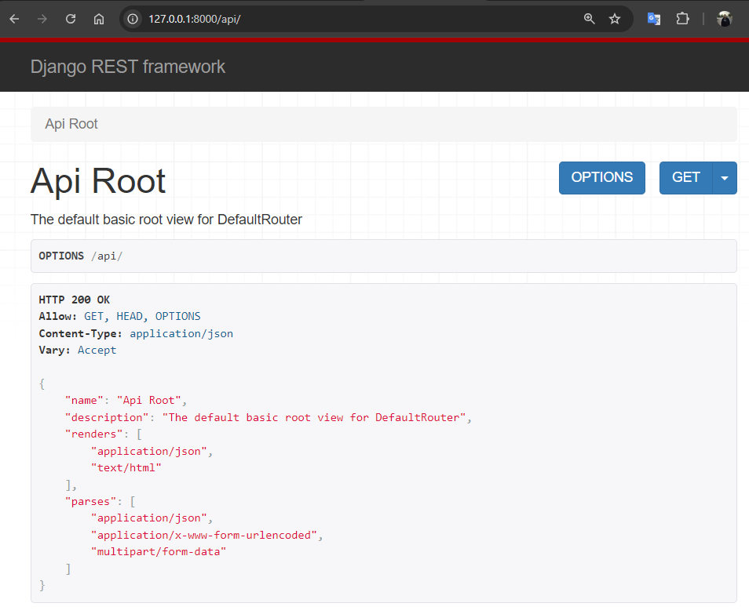
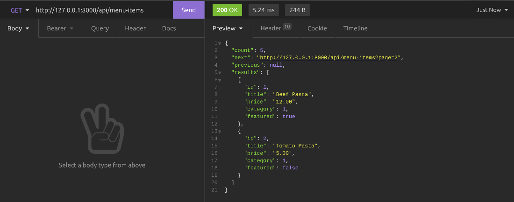

# Meta APIs Course - Final Project: Little Lemon API Development

## Overview

This repository contains the final project for the Meta APIs course on Coursera, focusing on building a robust API system for Little Lemon, a fictional restaurant. The project implements a Django REST Framework (DRF) API with token-based authentication, supporting three user roles: Managers, Customers, and Delivery Crew. It includes endpoints for user registration, menu management, cart functionality, order processing, and delivery tracking, with throttling limited to 5 requests per minute. The API ensures proper HTTP status codes and error handling, making it suitable for web and mobile application integration.

## Technologies Used

- **Framework**: Django, Django REST Framework (DRF)
- **Authentication**: Djoser (token-based)
- **Database**: SQLite3
- **Tools**: VS Code, Insomnia (for testing), pipenv
- **Dependencies**: Managed via `requirements.txt`

## Project Structure

```
.
├── LittleLemonAPI/          # App directory
│   ├── __init__.py
│   ├── admin.py
│   ├── apps.py
│   ├── migrations/          # Migration files
│   ├── models.py
│   ├── serializers.py
│   ├── tests.py
│   ├── urls.py
│   ├── views.py
│   └── permissions.py
├── littlelemon/             # Project directory
│   ├── __init__.py
│   ├── asgi.py
│   ├── settings.py
│   ├── urls.py
│   └── wsgi.py
├── db.sqlite3               # SQLite database
├── manage.py                # Django management script
├── Pipfile                  # Pipenv dependency file
├── Pipfile.lock
├── populate_db.py           # Script to populate database
├── requirements.txt         # Python dependencies
├── static/                  # Static files
└── screenshots/             # Demo screenshots
    ├── 1-demo-root-api.PNG
    ├── 2-demo-menu-items-api.png
    ├── 3-demo-http-get-to-menu-items.png
    ├── 4-demo-adding-user-manager-with-token.png
    ├── 5-demo-http-body-content.png
```

## Setup and Usage Guide

Follow these steps to set up and use the Little Lemon API project on your local machine.

### 1. Prerequisites
Ensure you have Python 3.8+ and pip installed.

### 2. Create and Activate a Virtual Environment
Use a virtual environment to isolate dependencies:
```bash
python -m venv venv
# On Windows: venv\Scripts\activate
# On macOS/Linux: source venv/bin/activate
```

### 3. Install Dependencies
With the virtual environment active, install required packages:
```bash
pip install -r requirements.txt
```

### 4. Database Setup
Apply migrations to create database tables:
```bash
python manage.py makemigrations
python manage.py migrate
```
You’ll see output confirming the migrations.

### 5. Create a Superuser and User Groups
Create a superuser for admin access:
```bash
python manage.py createsuperuser
```
- Follow prompts to set username, email, and password.
- Run the server (`python manage.py runserver`) and access http://127.0.0.1:8000/admin/ to log in.
- In the admin panel, create `Manager` and `Delivery Crew` groups, and add test users to these groups. Users without groups are considered Customers.

### 6. Populate the Database (Optional)
For testing, populate with sample data:
```bash
python manage.py runscript populate_db
```

### 7. Run the Server
Start the development server:
```bash
python manage.py runserver
```
The API is accessible at http://127.0.0.1:8000/api/.

### 8. Testing and Using the APIs
Use an API client like Insomnia to test endpoints. Obtain a token first by posting to http://127.0.0.1:8000/api/token/login/ with a username and password. Include the token in the `Authorization: Token <your-auth-token>` header for protected endpoints.

#### API Demo
- **Root API**: View available endpoints.
  

- **List Menu Items**: GET http://127.0.0.1:8000/api/menu-items/

    Browsing menu-items endpoint using the browser:
  

    Making an HTTP GET call to menu-items endpoint:
  

- **Add Manager with Token**: Adding a user as a manager with admin token using POST http://127.0.0.1:8000/api/groups/manager/users/ with token.
  

- **HTTP Body Content**: The HTTP body content to add a user to the manager group with an admin token.
  

#### Key Endpoints
- **User Registration**: POST /api/users/
- **Token Login**: POST /token/login/
- **Menu Items**: GET/POST/PUT/DELETE /api/menu-items/ (role-dependent)
- **Cart Management**: GET/POST/DELETE /api/cart/menu-items/
- **Order Management**: GET/POST/PUT/PATCH/DELETE /api/orders/ (role-dependent)

#### Throttling
Limited to 5 requests per minute for all users.

## Features Implemented

- **User Roles**: Managers, Delivery Crew, and Customers with specific permissions.
- **Menu Management**: Managers can add, edit, and remove menu items; Customers can browse and filter.
- **Cart Functionality**: Customers can add items, place orders (clearing cart), and flush carts.
- **Order Processing**: Managers assign delivery crew, Delivery Crew updates status, Customers view orders.
- **Authentication**: Token-based via Djoser, no session authentication.
- **Error Handling**: Appropriate HTTP status codes (200, 201, 403, 401, 400, 404).
- **Filtering/Pagination**: Applied to /api/menu-items/ and /api/orders/.

## General Notes

- Use only course-approved packages (DRF, Djoser, etc.).
- Test thoroughly with Insomnia, ensuring correct methods and status codes.
- The project is designed for Little Lemon’s web and mobile apps, deployed via Django.

## License

This project is based on Meta course materials for educational purposes. See the [LICENSE](LICENSE) file for details.